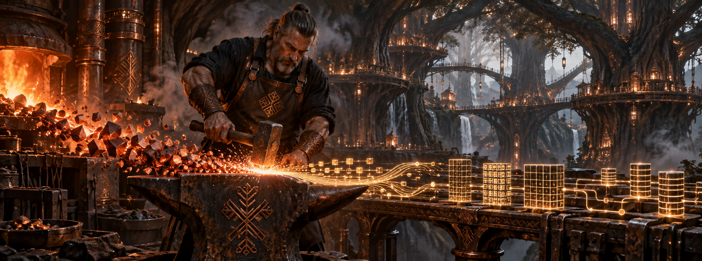

# Hadur Data Platform

> **From raw ore to trusted data.**

Hadur Data Platform is a data infrastructure project that transforms messy provider data into clean, validated, customer-ready datasets.

The platform follows the same essential rhythm as a blacksmith's forge:

**ingest → refine → test → shape → deliver**

The project demonstrates a provider-to-customer data platform and the engineering discipline required to build one.

## Why Hadúr?

Hadur Data Platform takes its name from Hadúr, the Hungarian divine blacksmith associated with fire, metallurgy, and the forging of weapons for gods and heroes.

His forge stands in the Copper Forest of the cosmic World Tree. There, raw metal is heated, purified, hammered, and transformed into artifacts of power — including, in legend, the Sword of God (*Isten Kardja*), later discovered by Attila the Hun.

Hadur Data Platform applies that imagery to data engineering. Raw data arrives incomplete, inconsistent, duplicated, and malformed. It has potential, but it is not yet fit for use. The platform supplies the structure, heat, pressure, and quality controls needed to forge it into something trustworthy.

Here, the artifacts are not swords. They are dependable data products.

> **Naming convention:** The platform and repository use the ASCII spelling `Hadur`. The mythological figure is written using the original Hungarian spelling, `Hadúr`.

## The Cosmic Data Forge

1. Raw ore drawn from the earth
2. Hadúr's fire
3. The copper anvil
4. Hammer and tongs
5. Removing impurities
6. Reworking flawed metal
7. Testing the blade
8. Artifacts forged for the gods
9. The Golden Rooster watching the realms
10. The Sword of God

## From Raw Material to Gold

Hadur Data Platform follows the logical stages of the Medallion Architecture.

### Bronze — Raw material

Provider data enters the platform with its original values preserved.

### Silver — The forge

Transformations clean and refine the raw material.

### Gold — Artifacts of power

Validated data is shaped into its final customer-facing form.

## Two Platform Eras

*Details pending.*

## Version 1

### Architecture

*Details pending.*

### Technology Stack

*Details pending.*

## Version 2

### Architecture

*Details pending.*

### Technology Stack

*Details pending.*

## Project Principles

1. **Preserve the raw truth.** Source data should remain traceable and reproducible.
2. **Make bad data visible.** Quarantine records with reasons instead of silently dropping them.
3. **Test before publishing.** Customer-facing outputs must pass an explicit quality gate.
4. **Keep transformations testable and portable.**
5. **Separate orchestration from transformation.**
6. **Design for migration.** The project will migrate from a Version 1 tech stack on small-scale data to a Version 2 tech stack on production-scale data.
7. **Document the reasoning.** Architecture and documentation are first-class project artifacts.

## Current Status

*Details pending.*
